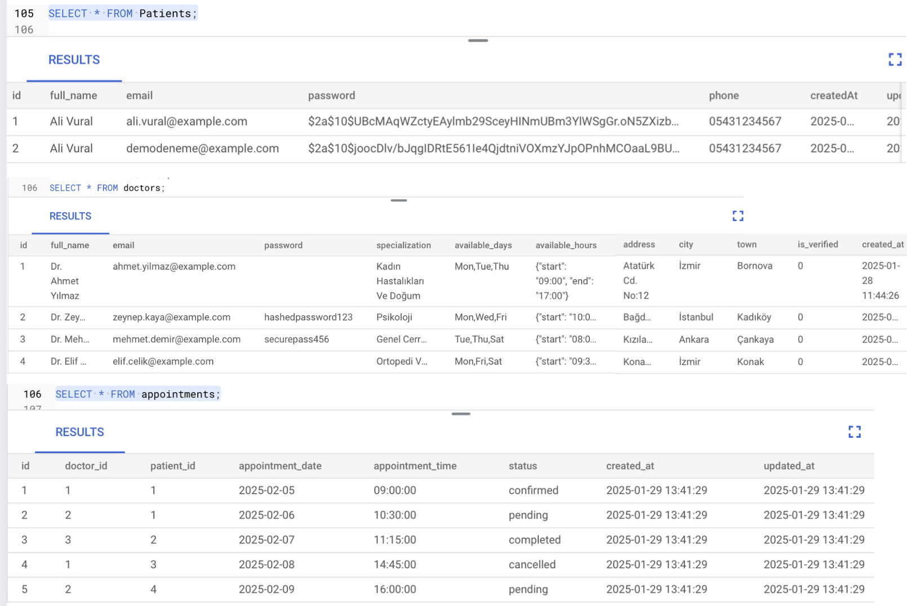

# **Doctor - Patient Portal  - Project Documentation**  
---

## **Overview**  
The Doctor-Patient Appointment System is a web-based platform designed to facilitate seamless appointment booking between doctors and patients. The system allows doctors to register and manage their availability, while patients can search for doctors, book appointments, and leave reviews. The system is built using a service-oriented architecture and deployed on Google Cloud.

---

## **Technologies Used**  
- **Backend Development:** Node.js, Express.js  
- **Database Management:** MySQL (Google Cloud SQL)  
- **Authentication:** Google OAuth  
- **Queue Service:** RabbitMQ (or synchronous fallback)  
- **Caching:** Redis 
- **API Documentation:** Swagger  
- **Frontend Framework:** React.js / Next.js  
- **Cloud Deployment:** Google Cloud (Cloud Run, Firebase Hosting)  

---

## **Databases**  
- doctors - patients - appointments - reviews
- comments aren't kept in the reviews database instead is kept in a No Sql database.
- There is no direct relationship between doctors and patients.Instead, they are linked through the appointments table.
One doctor can have many appointments with different patients.
One patient can have many appointments with different doctors.
- Each doctor can have multiple appointments.
Each appointment is associated with one doctor.
- One doctor can receive multiple reviews from different patients.
Each review is linked to one doctor.
- A doctor cannot exist without a specialization and verification.A patient cannot exist without an email and name. An appointment requires both a doctor and a patient.A review is only created if an appointment exists.Cascading delete ensures data consistency.
- 

---
## **Learning Outcomes**  

### **Database Management**  
- Designed an efficient database schema for MySQL on Google Cloud SQL.  
- Optimized queries for better performance.
- I used a database that didn't function on my localhost for the first time after switching to Azure. and I discovered Google to be quite easy to use. It was a learning that I will reflect on in my future projects.
- Additionally, it improved my ability to plan and envision the interactions between actors.

### **System Architecture**  
- Built a **scalable** and **modular** service-oriented architecture.  
- Integrated **Google Maps API** for doctor location services.
- Using Google Maps again was not difficult even for me as a new learner.

### **Cloud Deployment**  
- Deployed the **backend** on **Google Cloud Run** with a Docker container.  
- Configured **Google Cloud Scheduler** for background tasks.
- I downloaded something by accident and erased it, which is regrettably how the deployment process went. I had significant problems with it. Which I will address below.
- The reason I liked using Google Maps, or more accurately, Google Cloud in general, was that everything was accessible from its own sources without looking for a different source.

### **Problem-Solving**  
- Implemented caching with **Redis** to reduce load on the database.  
- Implemented a fallback mechanism for **RabbitMQ** in case of failure.
- One of the course's greatest contributions was the backend, which I finished using **Swagger** to verify before linking it to the frontend.

---

### Core Features

**Doctor Features
✅ Register via Google Authentication
✅ Enter and update availability for appointments
✅ Address details must be precise for Google Maps integration
✅ Admin approval required before appearing in search results

**Patient Features
✅ Search doctors by specialty, name, or location
✅ Autocomplete feature for search
✅ View doctor’s available appointment slots for the current week
✅ Book an appointment (Google login required)

**Review System
✅ Patients can rate doctors after their appointments
✅ Inappropriate language in reviews is automatically filtered
✅ Reviews are stored in a NoSQL database

**System Notifications
✅ Incomplete Appointment Notification: If a patient signs in but doesn’t complete an appointment, they receive a daily reminder
✅ Review Reminder Notification: Patients receive an email after their visit to rate their doctor
✅ Queue System: Used for sending notifications efficiently

---

## Challenges
### **Google Deployment**
- Due to GitHub-related problems, deployment was one of the more difficult parts, but it provided valuable instructional moments.
- I was able to get an address as a result(https://doctor-patient-portal-624117525458.us-central1.run.app ), but I was unable to connect the frontend and backend. due to having created them independently for the first time.
- I believe I could figure it out if I had more time. I therefore made the decision to work on a related project from scratch during the break. The knowledge I gained from the course has given me the determination to achieve this.

### **Understanding how to configure backend and frontend**
- I have never completed a project this comprehensive before. I had previously solely used NextJs for this purpose in the project where you gave me the chance to study, but I didn't want to use it here.
- If I could start over, I would have taken another pathway because I had to overcome a lot of challenges because of my 3rd grade knowledge and time restrictions.

---
## **Conclusion**  

Working on the **Doctor Appointment System** has significantly enhanced my understanding of API development, and cloud deployment. Throughout this project, I gained hands-on experience in designing **scalable and efficient database schemas**, implementing **secure authentication mechanisms**, and optimizing **API performance** using caching and queuing solutions.

Deploying the system on **Google Cloud** allowed me to learn about **Cloud Run, Cloud SQL**, while working with **RabbitMQ** to asynchronous task handling. Despite facing challenges in **integrating cloud services and optimizing API responses**, I was able to debug and resolve most of the issues effectively.

This project has strengthened my ability to **choose the right technologies** for different system components. Beyond building functional APIs, I also improved my skills in **system architecture and error handling**.The knowledge and skills gained here will undoubtedly help me in future projects, particularly in **full-stack development and cloud-based application deployment**. 
