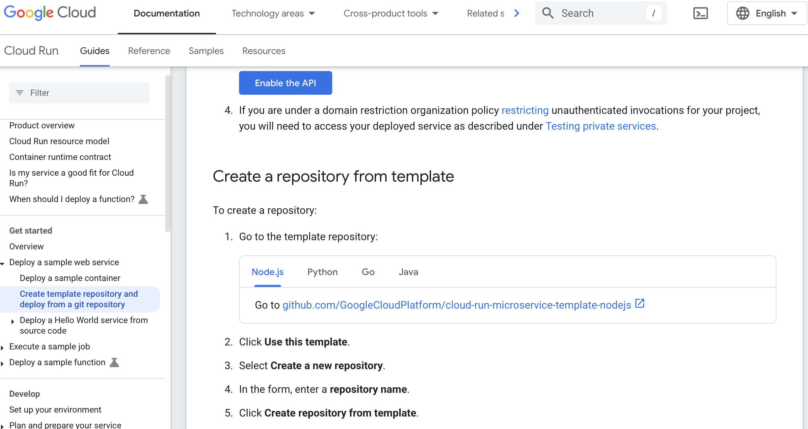

Doctor-Patient Appointment System

Overview

The Doctor-Patient Appointment System is a web-based platform designed to facilitate seamless appointment booking between doctors and patients. The system allows doctors to register and manage their availability, while patients can search for doctors, book appointments, and leave reviews. The system is built using a service-oriented architecture and deployed on Google Cloud.

Technologies Used

Frontend: React.js

Backend: Node.js, Express.js

Database: MySQL (Cloud SQL on Google Cloud)

Authentication: Google OAuth

Deployment: Google Cloud Run

API Gateway: Implemented via a custom API Gateway

Queue Management: RabbitMQ for asynchronous messaging

Caching: Redis for storing frequently accessed data

Scheduling: Google Cloud Scheduler

