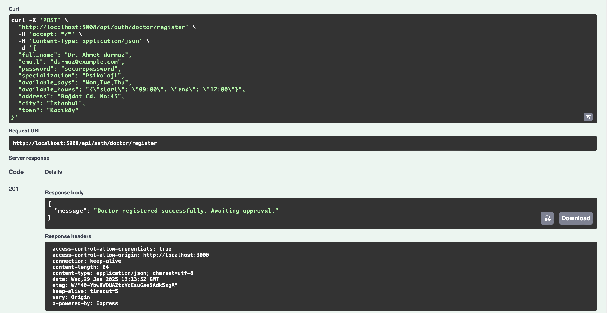
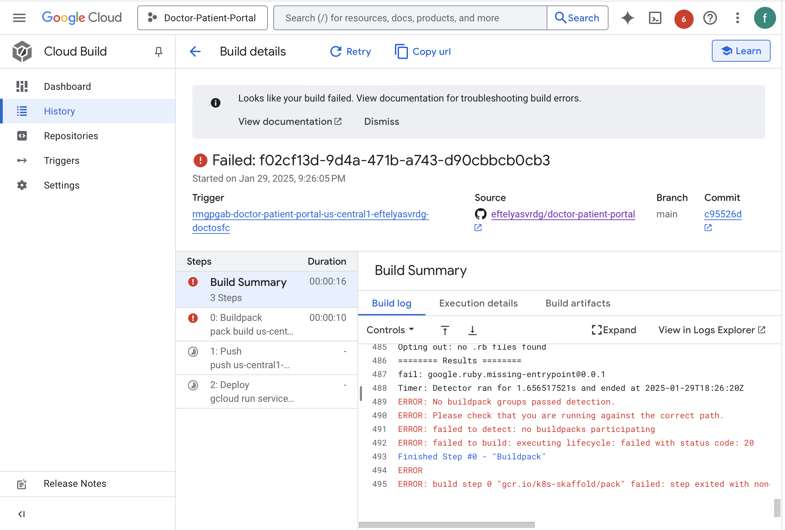

# **Doctor Appointment System - Project Documentation**  
---

## **Overview**  
The Doctor-Patient Appointment System is a web-based platform designed to facilitate seamless appointment booking between doctors and patients. The system allows doctors to register and manage their availability, while patients can search for doctors, book appointments, and leave reviews. The system is built using a service-oriented architecture and deployed on Google Cloud.

---

## **Technologies Used**  
- **Backend Development:** Node.js, Express.js  
- **Database Management:** MySQL (Google Cloud SQL)  
- **Authentication:** Google OAuth  
- **Queue Service:** RabbitMQ (or synchronous fallback)  
- **Caching:** Redis 
- **API Documentation:** Swagger  
- **Frontend Framework:** React.js / Next.js  
- **Cloud Deployment:** Google Cloud (Cloud Run, Firebase Hosting)  

---
## **Learning Outcomes**  

### **Database Management**  
- Designed an efficient database schema for MySQL on Google Cloud SQL.  
- Optimized queries for better performance.
- I used a database that didn't function on my localhost for the first time after switching to Azure. and I discovered Google to be quite easy to use. It was a learning that I will reflect on in my future projects.
- Additionally, it improved my ability to plan and envision the interactions between actors.

### **System Architecture**  
- Built a **scalable** and **modular** service-oriented architecture.  
- Integrated **Google Maps API** for doctor location services.
- Using Google Maps again was not difficult even for me as a new learner.

### **Cloud Deployment**  
- Deployed the **backend** on **Google Cloud Run** with a Docker container.  
- Configured **Google Cloud Scheduler** for background tasks.
- I downloaded something by accident and erased it, which is regrettably how the deployment process went. I had significant problems with it. Which I will address below.

### **Problem-Solving**  
- Implemented caching with **Redis** to reduce load on the database.  
- Implemented a fallback mechanism for **RabbitMQ** in case of failure.
- One of the course's greatest contributions was the backend, which I finished using **Swagger** to verify before linking it to the frontend.

---

### Core Features

**Doctor Features
✅ Register via Google Authentication
✅ Enter and update availability for appointments
✅ Address details must be precise for Google Maps integration
✅ Admin approval required before appearing in search results

**Patient Features
✅ Search doctors by specialty, name, or location
✅ Autocomplete feature for search
✅ View doctor’s available appointment slots for the current week
✅ Book an appointment (Google login required)

**Review System
✅ Patients can rate doctors after their appointments
✅ Inappropriate language in reviews is automatically filtered
✅ Reviews are stored in a NoSQL database (Cloud Firestore or MongoDB Atlas)

**System Notifications
✅ Incomplete Appointment Notification: If a patient signs in but doesn’t complete an appointment, they receive a daily reminder
✅ Review Reminder Notification: Patients receive an email after their visit to rate their doctor
✅ Queue System: Used for sending notifications efficiently

---

## Challenges
### **Google Deployment**
- Due to GitHub-related problems, deployment was one of the more difficult parts, but it provided valuable instructional moments.
- I was able to get an address as a result(https://doctor-patient-portal-624117525458.us-central1.run.app ), but I was unable to connect the frontend and backend. due to having created them independently for the first time.
- I believe I could figure it out if I had more time. I therefore made the decision to work on a related project from scratch during the break. The knowledge I gained from the course has given me the determination to achieve this.

